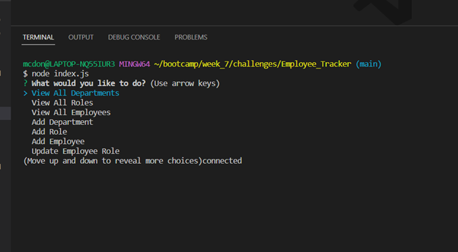
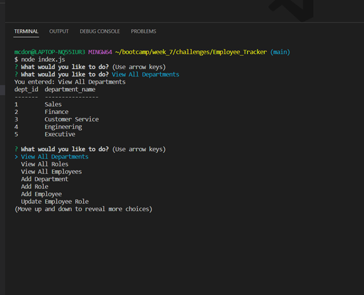
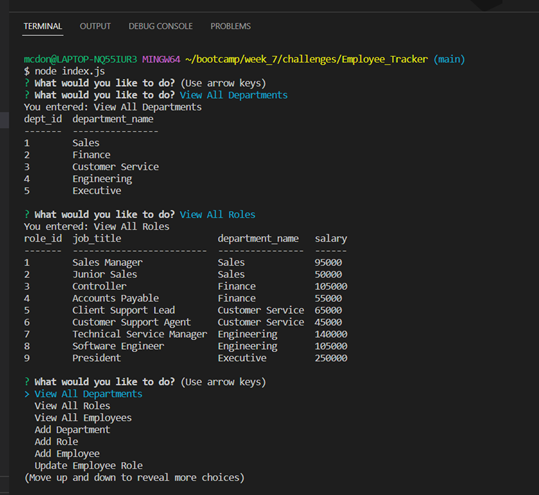
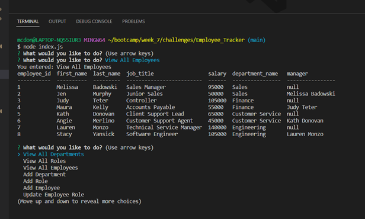

# Employee Tracker

## Description

This is an application that allows an employer to view a table of their company's departments, roles, and employees. In the employee table, they have quick access to the employee's number, first name, last name, job title, department, manager, and salary. In the roles table, the employer can quickly access role id's, job titles, and the salary associated with that role. In the department table, the employer can view department id's and department names. The application also allows the employer to add new employees, update existing employees and create new roles and departments.

## Table of Contents

- [Installation](#installation)
- [License](#license)
- [Usage](#usage)
- [ScreenShots](#screenshots)
- [Video](#video)
- [Links to Deployment](#linkstodeployment)
- [Credits](#LinkstoDeployment)
- [Contribution](#contribution)
- [Tests](#tests)
- [Questions](#questions)

## Installation

Clone the repo
npm install

## License

MIT

## Usage

1. Run node index.js
2. View and follow the prompts

## ScreenShots

## Video

https://drive.google.com/file/d/1-lpkoF1Ae0VxrKOpBGKiJZHI62Qj54Ez/view?usp=sharing

## Links to Deployment

https://github.com/MegMathis/Employee_Tracker

## Credits

Tutoring with Armando

Ask BCS

https://www.w3schools.com/mysql/mysql_constraints.asp

https://www.npmjs.com/package/mysql2

https://www.npmjs.com/package/inquirer

https://www.simplilearn.com/tutorials/nodejs-tutorial/nodejs-mysql

https://www.youtube.com/watch?v=p3qvj9hO_Bo

https://dev.mysql.com/doc/mysql-tutorial-excerpt/8.0/en/example-foreign-keys.html

https://learnsql.com/blog/concatenate-two-columns-in-sql/

https://www.w3resource.com/sql/joins/perform-a-self-join.php

https://www.youtube.com/watch?v=9yeOJ0ZMUYw&t=329s

https://stackoverflow.com/questions/1435177/why-does-this-sql-code-give-error-1066-not-unique-table-alias-user

## Contribution

Megan Mathis

## Tests

n/a

## Questions

Any questions, please contact me at:

- GitHub:
  [MegMathis](http://github.com/MegMathis)
- Email:
  [mcdonough.megan25@gmail.com](mailto:mcdonough.megan25@gmail.com)
